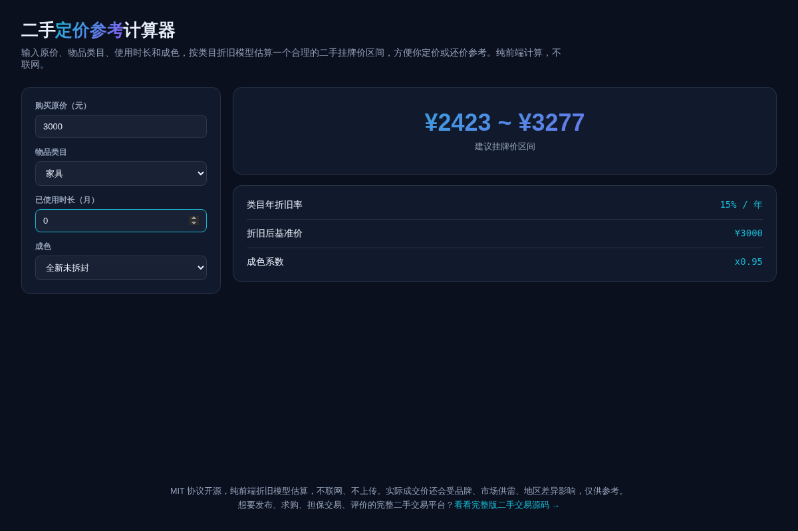

# 二手定价参考计算器 · Resale Price Estimator

**[在线体验 →](https://anna123123123-creator.github.io/resale-price-calc/)**

免费开源、纯浏览器运行的二手物品定价参考工具。输入购买原价、物品类目、使用时长和成色，按类目折旧模型估算一个合理的二手挂牌价区间，方便定价或还价参考。纯前端计算，不联网。



## 试用方法

直接用浏览器打开 `index.html`，或用静态文件服务器跑起来：

```bash
python3 -m http.server 8000
```

## 计算模型

```
折旧后基准价 = 原价 × (1 - 类目年折旧率)^(使用月数/12)
估算价 = 折旧后基准价 × 成色系数
建议区间 = 估算价 × [0.85, 1.15]
```

内置 5 个类目的年折旧率参考：电子产品 35%、家电 20%、家具 15%、服装/箱包 40%、其他 25%——电子产品折旧最快，家具最慢，符合日常经验。

**⚠️ 实际成交价还会受品牌溢价、市场供需、地区差异、外观细节等因素影响，本工具给出的是粗略参考区间，不是精确报价。**

## 协议

MIT。

## 相关项目

这个是做 **二手交易**产品时顺手做的免费定价参考小工具，跟主产品关系比较松散。想要发布、求购、担保交易、评价的完整二手交易平台？完整版在这：[全能源码 · 二手交易源码](https://inzyxuashop.com/ershou-yuanma.html)。
